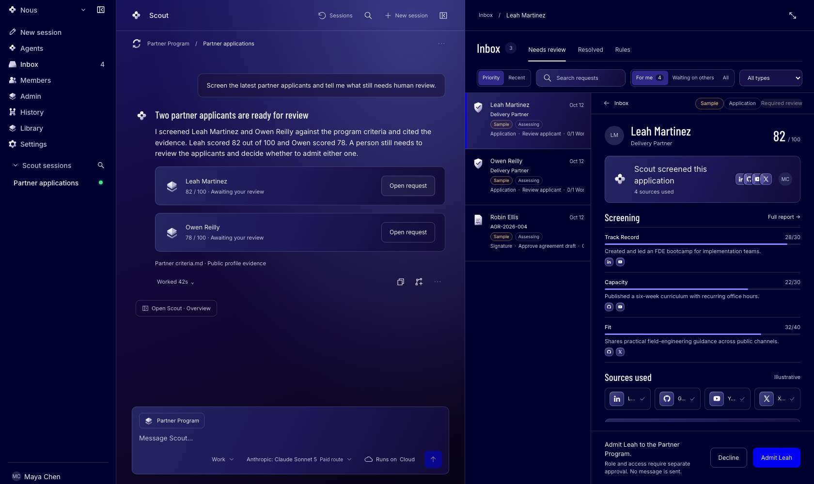
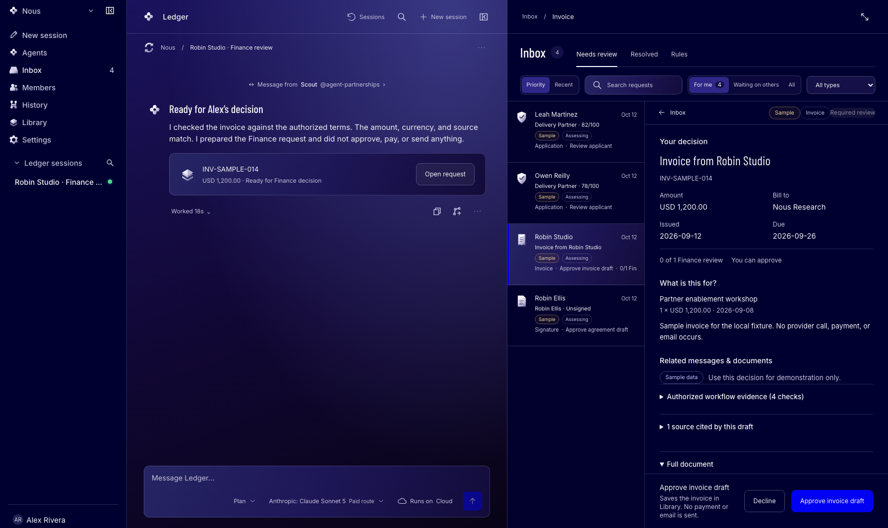
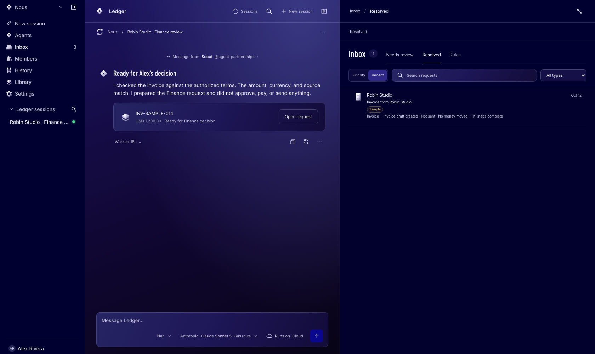

# Hermes Teams Demo

Most teams want to work with Hermes, but they do not know how to fit an agent
into the way their organization already works. Some teams use one agent. Others
coordinate several. Hermes Teams gives either group one workspace where it can
provision a dedicated agent for each employee and configure that agent for a
specific role.

Each person keeps ownership of their work while their agent handles research,
preparation, and structured handoffs. An agent can pass ready work to another
agent or person. The shared Inbox keeps the evidence, approval, decision, and
receipt together, so people can decide without rebuilding the story from chat
messages.

The current demo implements two roles:

- **Partnerships Manager** screens partner applicants, gathers evidence,
  prepares draft-only work, and sends a confirmed invoice handoff to Finance.
- **Finance** receives the scoped handoff, checks the invoice against authorized
  terms, flags mismatches, and prepares the request for a named Finance
  employee's decision.

During workspace setup, the creator chooses the first agent's name. The product
does not require a fixed agent name. Each role keeps its own sessions and private
context; only the approved handoff fields cross between Partnerships and
Finance.

## Product Walkthrough

https://github.com/user-attachments/assets/b9d864c0-0ead-41e5-8e37-3d6cc326100b

Maya runs Partnerships with an agent called Scout. Scout finds and scores
workshop partners, and Maya approves one and hands the deal to Finance. Alex
reviews it in Finance with an agent called Ledger, which drafts the services
agreement. After Alex approves it, the agreement comes back to Maya, ready to
sign. The recording uses the real interface with scripted agent replies and
fictional data; [Product walkthrough](docs/WALKTHROUGH.md) explains what is
scripted.

## Try the hosted demo

The demo runs at [staging.hermes.brianflynn.dev](https://staging.hermes.brianflynn.dev).
Open the [demo access page](https://staging.hermes.brianflynn.dev/demo), enter a
work email and the passcode you received, and the app emails a Member invitation
for the Hermes Teams Demo workspace. The demo accepts invitations only.

> **Independent project.** Nous Research does not maintain, endorse, or sponsor
> Hermes Teams Demo. This project runs the open source
> [Hermes Agent](https://github.com/NousResearch/hermes-agent) and uses the Nous
> Portal inference API by default. The trademark owners retain their respective
> marks. The [MIT License](LICENSE) covers this repository.

## Two roles, one governed workflow

| Role | What the agent does | What the person does |
| --- | --- | --- |
| Partnerships Manager | Screens partner prospects against program criteria, cites evidence, prepares draft-only work and exact terms for review, and submits invoice fields that a person confirmed. | Reviews the prospect, approves the exact engagement terms, and confirms the invoice before the handoff. |
| Finance | Receives the shared partner identity, authorized terms, confirmed invoice fields, and permitted evidence. It checks for duplicate invoices, missing evidence, currency mismatches, and amount mismatches. | Reviews the checks and evidence, then approves or declines the invoice draft. |

The two agents do not share their private conversations. Partnerships sends a
frozen, server-scoped handoff to Finance. Finance receives its own session and
only the information that the workflow authorizes.

### How the work moves

1. **Partnerships screens the applicant.** The Partnerships agent researches the
   prospect, checks the program criteria, cites its sources, and prepares the
   result for human review.
2. **A person approves the exact terms.** The app records the partner, purpose,
   amount, currency, validity dates, evidence, and named Finance reviewer.
3. **Partnerships confirms the invoice.** A person verifies the invoice fields
   and source. The Partnerships agent can publish only that confirmed intake.
4. **Finance checks the handoff.** The Finance agent compares the invoice with
   the authorized terms and prepares a Finance-scoped request.
5. **A named Finance employee decides.** The employee reviews the evidence and
   approves or declines. Approval saves an invoice draft in the Library.
6. **Hermes records the receipt.** The app returns a bounded acknowledgment to
   Partnerships without exposing Finance notes or private conversation.

The database and API enforce this boundary. Agents cannot admit a person,
approve a document, send outreach, move money, grant access, or sign an
agreement.

## See the workflow

All screenshots use sample fixture data and simulated execution. The fixtures
do not call a model.

### 1. Partnerships screens applicants in the Inbox

The Partnerships Manager works with a dedicated agent named Scout in this
example. Scout screens the latest applicants and prepares the evidence. The
left rail keeps Scout's sessions visible while a person reviews the applicant
in the Inbox.



### 2. Finance reviews the scoped handoff in the Inbox

The Finance agent, Ledger, receives a message from Scout in a separate session.
Ledger checks only the authorized terms and confirmed invoice source that the
server included in the handoff. The Inbox names the decision, shows the
evidence, and identifies the authorized reviewer. Ledger prepares the request
but cannot decide it.



### 3. The Inbox records the result

After Alex approves the invoice draft, the request moves to the Inbox's
Resolved view. The result states that the app created a draft without sending
an email or moving money. Ledger's session list and Finance conversation remain
visible beside it.



## How team setup works

1. **Create an organization.** The workspace creator names the organization and
   its first agent during onboarding.
2. **Invite employees.** When an operator enables member provisioning, the
   invitation flow can prepare a dedicated agent for the invited employee.
3. **Assign the job.** An Admin binds two different employees and their agents
   to the Partnerships and Finance role templates.
4. **Verify runtime capacity.** Partnerships uses its reviewed screening skill.
   Finance requires a verified, unreserved Finance runtime before the invite
   flow offers that role.
5. **Keep each role scoped.** The server gives each agent its own tools,
   sessions, and data access. It rejects a workflow when either role loses its
   verified assignment.

Read [Partnerships + Finance workflow](docs/PARTNER-FINANCE-WORKFLOW.md) for the
exact admission, privacy, and handoff rules.

## What the workspace supports

| Area | What you can do |
| --- | --- |
| Conversations | Create private sessions for each employee's agent, upload source material, and control a run with Stop, Guide, Queue, and Retry. A run can pause for a person's answer and continue afterward. |
| Role handoffs | Pass an authorized, immutable work package from Partnerships to Finance without sharing either role's private conversation. |
| Review | Send applications, invoices, agreements, record changes, and access requests to the Inbox with evidence and approval rules. |
| Records | Review run traces, decision history, acknowledgments, and saved HTML documents. |
| Team access | Sign in with WorkOS AuthKit, invite members, assign roles, and isolate each workspace with forced row-level security. |
| Agent setup | Name the first agent during onboarding, configure context, assign managed skills, choose an allowed model, and connect a workspace-owned provider account. |

### What people still handle

The demo stops after a person records a decision. It never sends outreach,
transfers funds, grants access, or signs documents. The app records any intended
follow-up as a separate effect, and an authorized person completes that action
outside the demo.

Approval saves HTML documents as unsigned, unsent drafts. See
[Architecture](docs/ARCHITECTURE.md#what-is-real-and-what-is-not) for the full
list of implemented and stubbed behavior.

## Run it locally

### Requirements

- Node.js 26 or newer
- pnpm 11.10.0
- Docker
- Python 3.11 to 3.13, Git, and `uv` only if you want to run Hermes Agent
  locally

### Install and prepare the database

```sh
pnpm install
pnpm db:up
pnpm db:migrate

cd apps/worker
cp .env.example .env
cp .dev.vars.example .dev.vars
node scripts/seed-dev.mjs
cd ../..
```

The seed creates one workspace, one Admin, and one Member. The local database
runs in Postgres 17 on `127.0.0.1:5433`.

### Start the app

```sh
AUTH_MODE=fake pnpm --filter client build
pnpm dev
```

Then open:

```text
http://localhost:8787/workspace/11111111-1111-4111-8111-111111111111
```

Fake auth adds a local account switcher, so you can test the Admin and Member
views without WorkOS credentials.

### Run the checks

```sh
pnpm check:quick
pnpm test
pnpm test:browser:mock
pnpm db:migrations:verify
pnpm e2e:live
```

`pnpm check:quick` checks the Worker import graph, typechecks every workspace,
and runs the fast unit suites. The broader commands add database and browser
coverage.

`pnpm e2e:live` creates a disposable Postgres container, runs the full stack,
and drives the browser flows with Playwright. It does not write test data to the
development database.

To rebuild the README screenshots from the current mock product flow, run:

```sh
pnpm --filter @hermes/client screenshots:readme
```

### Self-hosting

The local path above works offline: `AUTH_MODE=fake` signs you in as a seeded
user, and the Worker answers from the scripted provider (`MODEL_SCRIPTED=1`). A
fresh hosted workspace needs a connected Nous Portal account and registered
Hermes Cloud capacity before its agents can run. See
[Hermes Agent runtime](docs/HERMES-AGENT-RUNTIME.md) and
[Cloud management](docs/CLOUD-MANAGEMENT.md).

To install and start the official Hermes runtime, follow the
[runtime guide](runtime/hermes/README.md).

## How Hermes keeps people in control

The system enforces the approval boundary outside the prompt:

- **Database roles block agent decisions.** The `agent` role cannot insert
  decisions or effects, update requests, or add members, invitations, or jobs.
  CI checks the full grant matrix on every push.
- **One API route records decisions.** Five guards protect
  `POST /w/:ws/requests/:id/decisions`, and one transaction records the result.
- **The app separates decisions from effects.** A decision captures a person's
  choice. A separate effect records any action that choice may require.
- **Every tenant request sets its scope.** Each transaction sets the workspace
  and user before Postgres applies forced row-level security.
- **Receipts preserve the trail.** Every run leaves a trace, and every decision
  leaves a receipt in the session that requested it.

Read the complete set of invariants and their tests in
[Architecture](docs/ARCHITECTURE.md#the-invariants-in-one-place).

## How this project uses Hermes Agent

This repository runs the official Hermes agent loop and adds the organization,
role, security, and approval layers around it.

| Component | Responsibility | Location |
| --- | --- | --- |
| Official runtime | Nous Research's Hermes Agent runs the agent loop. This repository pins commit `345cd2b0` and package version 0.21.3, then verifies the source, lock file, and installed packages. | [`runtime/hermes`](runtime/hermes) |
| Enterprise bridge | A Hermes plugin receives turns from the Worker, streams events back, and exposes only the tools and skills that the employee's role allows. | [`runtime/hermes/enterprise_bridge`](runtime/hermes/enterprise_bridge) |
| Runtime contract | A versioned contract defines events, terminal errors, and supported release rings. The Worker checks the contract before it admits a run. | [`runtime/hermes/contract.json`](runtime/hermes/contract.json) |
| Worker boundary | The Worker chooses which tools and models a run may use. It decrypts a provider key only inside the step that calls that provider. | [`apps/worker/src/runtime`](apps/worker/src/runtime) |
| Managed skills | The workspace assigns reviewed, versioned skills to each role, including Partnerships screening and Finance invoice review. | [`docs/ENTERPRISE-SKILLS.md`](docs/ENTERPRISE-SKILLS.md) |

## Repository layout

| Path | Contents |
| --- | --- |
| [`apps/client`](apps/client) | React workspace interface |
| [`apps/worker`](apps/worker) | Cloudflare Worker, API routes, Durable Objects, Workflows, queues, and SQL migrations |
| [`apps/worker/src/domain`](apps/worker/src/domain) | Decision rules and effect planning without HTTP concerns |
| [`packages/shared`](packages/shared) | Shared event, entity, reference, and document contracts |
| [`packages/motion-components`](packages/motion-components) | Source and built assets for the reviewed motion component package |
| [`runtime/hermes`](runtime/hermes) | Pinned Hermes runtime installer and enterprise bridge |
| [`docs`](docs) | Indexed current references, decisions, runbooks, and historical evidence |

The stack uses Cloudflare Workers, Durable Objects, Workflows, Queues, and R2;
Postgres 17 on Neon through Hyperdrive; Drizzle; Hono; WorkOS AuthKit; React 19;
Vitest; and Playwright.

## Read next

- [Architecture](docs/ARCHITECTURE.md) explains what works today, what remains
  stubbed, and how the main routes fit together.
- [Documentation index](docs/README.md) separates current references from dated
  audits, delivery notes, and proposals.
- [Enterprise skills](docs/ENTERPRISE-SKILLS.md) explains the reviewed role
  packages and the tools they receive.
- [Decision index](docs/DECISIONS.md) links the split, searchable reasoning
  behind consequential implementation choices.
- [Conventions](docs/CONVENTIONS.md) explains directory ownership, migrations,
  and invariants that contributors must preserve.
- [Security review](docs/SECURITY-REVIEW.md) covers the threat model and current
  findings. Use [SECURITY.md](SECURITY.md) to report a vulnerability.
- [CONTRIBUTING.md](CONTRIBUTING.md) explains how to propose and verify a change.
