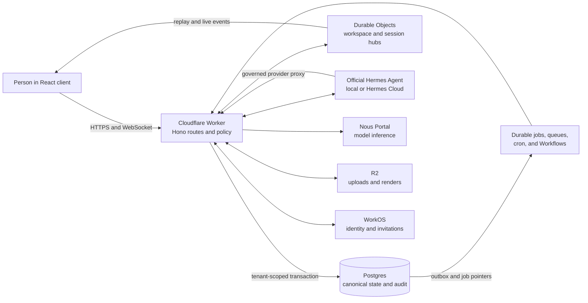
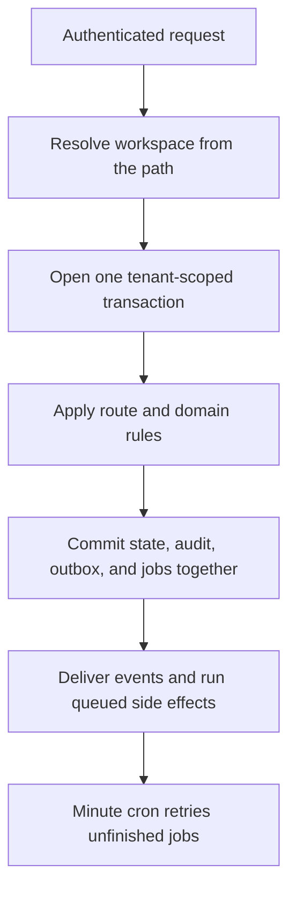

# Architecture and operations

This is the current system reference for Hermes Teams Demo. Start with the
[README](../README.md) for the product tour, use the [documentation index](README.md)
to find a focused guide, and read [AGENTS.md](../AGENTS.md) before changing code.

Hermes Teams is an enterprise control plane around the official Hermes Agent
runtime. The application owns identity, tenant isolation, policy, durable state,
human approvals, and browser delivery. Hermes Agent owns the model and tool
loop. Postgres is the source of truth; prompts and client state are never an
authority boundary.

## System shape



The central write path is intentionally narrow:



Routes own HTTP parsing and authentication. `src/domain` owns business rules.
Infrastructure modules implement integrations. `jobs.ts` owns durable dispatch,
but job handlers load at that boundary instead of importing the dispatcher back
through route orchestration. `pnpm lint:imports` enforces an acyclic Worker
runtime graph.

## Authority boundaries

| Boundary | Enforced by |
| --- | --- |
| Workspace isolation | A workspace ID from the URL, one scoped transaction, forced Postgres row-level security, and a membership lookup |
| Human decisions | The guarded decision route, the `app` database role, approval evidence, and revision checks |
| Agent limits | The restricted `agent` database role plus server-owned tool, skill, model, and operation policy |
| Runtime admission | A versioned Hermes contract, release-ring attestation, capacity checks, and exact run-attempt identity |
| Delivery and retries | Transactional outbox rows, durable job pointers, queues, Workflows, and idempotency keys |
| Secrets | Envelope encryption at rest and decryption only inside the provider step that needs the key |

## What is implemented and intentionally limited

| Implemented | Intentional limit or external prerequisite |
| --- | --- |
| WorkOS and local fake authentication, workspace creation, invitations, membership, step-up, and revocation | A hosted deployment needs configured WorkOS credentials and webhook or poller settings |
| Private sessions, the official Hermes run loop, streaming, Stop, Guide, Queue, Retry, recovery, traces, and model selection | A hosted run needs verified Hermes capacity and a connected Nous Portal account |
| Guarded requests, decisions, immutable evidence, receipts, history, role handoffs, and draft documents | Outreach, payment, access grants, and signatures remain recorded effects for a person to execute; this repository does not execute them |
| Upload validation, extraction, R2 storage, HTML rendering, retention hooks, and subject erasure | PDF rendering is unavailable under workerd, so documents expose the HTML render and an explicit PDF status |
| Durable event delivery through outbox rows, jobs, queues, Workflows, cron, and hibernating WebSockets | Optional external services fail without changing canonical product state |
| Local scripted-provider development, mock browser tests, disposable live-stack tests, staging, and production configuration | Mock and scripted flows are clearly separated from live model behavior |

## Run it locally

The application and test suites work offline after dependencies are installed.
The pinned gitleaks, actionlint, and official Hermes installers download their
verified upstream artifacts when invoked.

The opt-in Partner Program source connector and Iris review handoff are
documented in [`docs/PARTNER-SCREENING.md`](PARTNER-SCREENING.md). It keeps
live GitHub evidence, deterministic source triage, Iris judgment, and human
review separate. The Partner Program onboarding now begins with a bounded live
search rather than fabricated candidates.

Enterprise-packaged Hermes skills, including the managed Partner Program
screening procedure, are documented in
[`docs/ENTERPRISE-SKILLS.md`](ENTERPRISE-SKILLS.md).

```sh
pnpm install

# Postgres 17 in Docker on 127.0.0.1:5433 (5432 is often taken).
pnpm db:up

# Creates the three roles and applies only pending migrations.
pnpm db:migrate

# Creates a disposable shadow database, replays the full catalog there, checks
# the schema fingerprint, and drops the database. CI runs this automatically.
pnpm db:migrations:verify

pnpm typecheck
pnpm test          # shared/client/worker units, workerd tests, database tests
pnpm test:browser:mock  # credential-free client browser flows; not the live Worker
```

### Two isolated database stacks

| | database | container | who writes to it |
|---|---|---|---|
| dev | `hermes` | durable `hermes-postgres` | you, through `pnpm --filter @hermes/worker dev` on :8787 |
| test | unique `hermes_test_*` | disposable and owned per invocation | `pnpm e2e:live`, `pnpm db:test`, the worker Vitest projects |

They share nothing. The suites used to run against `hermes`, which meant a live
end-to-end session filled the Inbox you were reading with scripted requests,
put fifty test sessions in your session list, and reset the workspace's default
model to the seed's. `scripts/test-db.mjs` now creates a labelled container on
a Docker-assigned loopback port, migrates and seeds its unique database, and
removes only that verified container when the invocation ends.

```sh
pnpm db:test:up    # keep one owned disposable target alive until Ctrl-C
```

### Starting the dev database over

```sh
pnpm db:reset      # hermes only: recreate, migrate, seed — keeping the provider keys
```

`db:reset` is the one command for "the demo data looks wrong". Three things to
know about it:

* it is **destructive** for `hermes` — every row goes and comes back as the seed:
  one workspace, one Admin (`maya@nous.example`), one Member
  (`dana@nous.example`);
* it **does not** touch `hermes_test`, and it no longer runs
  `docker compose down -v`, which would have: it drops and recreates the one
  database instead;
* it **keeps the seed workspace's provider keys**. A wrapped provider key is a
  real credential, and it is the only thing in that database no script can
  regenerate.

It refuses to run under `NODE_ENV=production`, or with a `DATABASE_URL` that
does not point at localhost.

To serve it:

```sh
cd apps/worker
cp .env.example .env              # the two Hyperdrive local connection strings
cp .dev.vars.example .dev.vars    # secret names; empty is fine in fake mode
node scripts/seed-dev.mjs         # one workspace, one Admin, one Member
npx wrangler dev --local
```

The seed prints its credential-free target before connecting. It accepts a
loopback database or a clearly test-named database such as `hermes_test`; any
other target is refused unless the exceptional
`HERMES_SEED_ALLOW_NONLOCAL=1` override is supplied intentionally.

That serves the API *and* the client, from `apps/client/dist`, which the assets
binding points at. Build it first, with fake auth so the dev account switcher
survives, and open the workspace:

```sh
AUTH_MODE=fake pnpm --filter client build
open http://localhost:8787/workspace/11111111-1111-4111-8111-111111111111
```

`/workspace/:ws`, not `/w/:ws`: `/w/*` is in the Worker's `run_worker_first`
list and its catch-all answers JSON, so the SPA fallback never sees a navigation
there (DECISIONS, C12). `apps/client/README.md` has the rest, including the
server findings this integration turned up and what each one costs.

To run the whole thing end to end, including Postgres, migrations, seed, bundle,
Worker, and the live Playwright scenarios:

```sh
pnpm e2e:live
```

Then:

```sh
curl http://localhost:8787/health
curl -H "x-dev-user: maya@nous.example" \
  http://localhost:8787/w/11111111-1111-4111-8111-111111111111/bootstrap
curl -H "x-dev-user: maya@nous.example" \
  "http://localhost:8787/w/11111111-1111-4111-8111-111111111111/events?stream=workspace&after=0"

# The session refresh the client calls every four minutes: it re-seals the
# cookie and returns both stream heads and a hub ticket.
curl -H "x-dev-user: maya@nous.example" \
  "http://localhost:8787/auth/session?ws=11111111-1111-4111-8111-111111111111"

curl -X POST -H "x-dev-user: maya@nous.example" -H 'content-type: application/json' \
  -d '{"title":"Partner applications"}' \
  http://localhost:8787/w/11111111-1111-4111-8111-111111111111/sessions
```

`/health` returns 200 only when Postgres answers through **both** Hyperdrive
configs (they are separate configs with separate database roles) and a Durable
Object round trip succeeds. Anything else is 503 with a per-check reason.

## Bring your own key

Hermes never holds a model-provider account of its own. A workspace brings its
own key, the workspace is billed by its own provider, and the product's job is
to store that key so that nobody — including whoever runs this service — can
read it by accident.

**Nous Portal is the product inference provider** (decision C55). One
workspace key reaches the current model catalog through
`https://inference-api.nousresearch.com/v1`, and
`ALLOWED_PROVIDERS=nous_portal` enforces that boundary in every environment.
Installing, verifying or rotating another provider returns
`422 provider_not_allowed`; catalog and model selection expose only Nous Portal
rows. Legacy transport adapters remain compiled for historical records and
transport-specific tests, but are outside the product path.

A workspace starts on `nous:anthropic/claude-sonnet-5`. Migration 0024 writes a
disabled placeholder so the foreign key exists before credentials do. Verifying
a key makes one minimal one-token chat-completions request, then syncs the public
Nous Portal `/models` catalog. `/models` cannot verify credentials because it is
public. The same transaction moves a stale workspace default and its unarchived
sessions to the current default when necessary.

**How an Admin connects it.** In the client, use Settings → Provider keys →
**Connect Nous Portal**. The route requires an Admin session and a sign-in from
the last five minutes, computes a SHA-256 fingerprint and last four characters,
encrypts the key, and performs the minimal verification request. A 401 marks it
invalid; 403, 429 and 5xx leave it unverified for retry. The browser receives
only the masked key row.

The Nous Portal inference key and `HERMES_BRIDGE_SECRET` have separate jobs. The
Portal key pays for model inference and stays encrypted per workspace. The
bridge secret authenticates an official Hermes Agent runtime process to the
Worker; it does not grant model access and never appears in workspace Settings.

The live browser suite exercises add, verify, catalog sync, model selection,
rotation and removal against the real Worker routes with a development-only
fixture. The same route can be checked without a browser:

```sh
cd apps/worker
# A KEK for local development: 32 random bytes, base64. Put it in .dev.vars as
# KEK_V1. Never reuse it anywhere that matters.
node -e "console.log(require('node:crypto').randomBytes(32).toString('base64'))"

npx wrangler dev --local
```

```sh
WS=11111111-1111-4111-8111-111111111111
AUTH='x-dev-user: maya@nous.example'

# Add, verify and sync in one call. The response carries the masked row only.
curl -sX POST "http://localhost:8787/w/$WS/provider-keys" \
  -H "$AUTH" -H 'content-type: application/json' \
  -d '{"provider":"nous_portal","label":"Nous Portal","key":"<paste the key>"}'

# Settings data: provider, label, last4, fingerprint prefix, status, model count,
# who added it and the dates. Never the plaintext key.
curl -s -H "$AUTH" "http://localhost:8787/w/$WS/provider-keys"

# The model menu catalog. Search, provider, limit and cursor can narrow it.
curl -s -H "$AUTH" "http://localhost:8787/w/$WS/catalog?provider=nous_portal&limit=50"

# Re-verify, rotate and remove.
curl -sX POST "http://localhost:8787/w/$WS/provider-keys/$KEY_ID/verify" -H "$AUTH"
curl -sX POST "http://localhost:8787/w/$WS/provider-keys/$KEY_ID/rotate" \
  -H "$AUTH" -H 'content-type: application/json' -d '{"key":"<the new key>"}'
curl -sX DELETE "http://localhost:8787/w/$WS/provider-keys/$KEY_ID" -H "$AUTH"
```

Removing a key stops the runs that were using it and says how many, then zeroes
the ciphertext. Rotating keeps the old row so that `model_calls` history stays
answerable: a run from last month still points at the key that paid for it.

**How it is stored.** Envelope encryption on Web Crypto. Each key gets its own
AES-GCM data key; that data key is wrapped by a key-encryption key held as the
Worker secret `KEK_V{n}`. The additional authenticated data is split so the two
layers bind different things — the key ciphertext binds `(workspace_id, key_id)`
and the wrap binds `(workspace_id, key_id, kek_version)` — which is what lets a
KEK rotation re-wrap 48 bytes per row without any provider key's plaintext
existing anywhere. Moving a ciphertext to another row, or reading it as another
tenant, fails to decrypt: an independent check of what row-level security
already enforces.

The plaintext exists only inside the request that uses it. `resolveKey` runs
inside every provider step, so a rotated key is picked up at the next step and a
removed one stops the run at the next step. Nothing logs a key: every log line
this milestone writes goes through a redactor that strips `Authorization`,
`x-api-key` and `cf-aig-authorization` by name and key shapes by pattern, and a
test asserts that neither a log nor an error message survives carrying one.

**What the model menu does with it.** A catalog row is offered to a workspace
only when the catalog does not disable the row *and* the workspace holds a
verified key for that row's provider. The two are different answers and the API
says which: `disabled_code` is `catalog` for a model the pilot does not offer,
and `no_key`, `key_unverified` or `key_invalid` for one the workspace could
reach if it did something. Prices come from the catalog with the date they were
checked, and the Usage screen says "estimated, billed by your provider".

### Nous Portal

Nous Portal provides an OpenAI-compatible inference API and a catalog spanning
multiple model vendors. Catalog IDs use `nous:<vendor>/<model>` so durable usage
and audit rows retain the account that paid for inference; the adapter removes
that prefix at the wire boundary.

Get the key from Nous Portal and paste it only into Settings → Provider keys →
**Connect Nous Portal**. The key is encrypted before verification. Verification
calls `POST /v1/chat/completions` with one output token because `GET /v1/models`
is public and cannot prove a key is valid. After verification, the Worker fetches
`GET /v1/models` and stores model name, context window, per-million prices, tool
support and reasoning support. Weekly re-verification refreshes the catalog.

The model menu is searchable and grouped by the vendor segment. It shows price
and context, pins the company default, disables models without tool support, and
shows the effort control only when the model supports it.

`sync_nous_portal_catalog` is a tenant-safe `SECURITY DEFINER` function. Its body
can only write Nous Portal provider-list rows; it cannot overwrite seeded or
other-provider rows. The Worker keeps its SELECT-only catalog grant.

The development scenario (`apps/client/e2e/live-nous-portal.spec.ts`) uses
`NOUS_PORTAL_FIXTURE=1` to answer the one-token verification and `/models` from
a fixed local fixture. Three guards keep it out of deployments: it requires
`ENVIRONMENT=development`, is opt-in, and staging/production config omits the
flag. This fixture performs no paid or external model call.

The legacy OpenRouter adapter and its fixture remain for historical data and
transport regression tests. They are not offered by current workspace Settings
or the allowed-provider policy.

**Why not AI Gateway's own BYOK.** It stores keys in Secrets Store (100 per
account in beta, 20 gateways), its aliases work only on passthrough URLs with no
read-back, and any token with Run permission reaches every stored key. That is
fine for an account's own keys and wrong for tenant keys. An optional gateway
sits behind `MODEL_GATEWAY_MODE=passthrough`, is off in every environment, and
sends `cf-aig-collect-log-payload: false` on every request so that turning it on
does not create a second copy of every applicant's text. A test asserts there is
no configuration in which payload logging is on.


## Uploads

A file goes from the browser to R2 directly, and is checked when it arrives.

```
POST   /w/:ws/attachments              declare {name, size, mime} -> row + a presigned PUT
PUT    <the URL that came back>        the bytes, straight to R2 (the browser does this)
POST   /w/:ws/attachments/:id/complete sniff, hash, mark ready, enqueue `extract`
GET    /w/:ws/attachments/:id          metadata, plus a 5-minute presigned GET for the viewer
DELETE /w/:ws/attachments/:id          soft-delete the row, remove the object and its text
```

`/w/:ws/files` is the same five for `agent_files` — the agent's Context sources
— over the same bucket, the same sniff and the same extraction. Adding or
removing one is an Admin's act, because Context governs every future run.

**Limits.** 20 MB, one of `application/pdf`, `text/markdown`, `text/plain`, and
10 uploads per user per minute (a `rate_counters` upsert, counted at declaration
rather than completion: a script that mints a thousand URLs it never uses has
still asked us to sign a thousand URLs). The presigned PUT lasts 15 minutes; the
viewer's GET lasts 5.

**Why `complete` exists.** The name, the size and the type are all the client's
opinion. `complete` streams the object back through the binding, compares the
first bytes with the declared type, and computes the sha256 the row records. A
renamed executable declared as `text/plain` is refused, the row is marked
`failed` with the reason, and the object is deleted rather than left for the
daily sweep. Two tests cover exactly that, plus a size that disagrees with the
declaration.

**Extraction.** `complete` enqueues `extract`, whose consumer writes the text to
R2 next to the object as `{key}.txt` and puts `text_length` and `token_estimate`
on the row. The queue has `max_retries: 3` and a dead-letter queue, and the DLQ
has a consumer whose whole job is to write `extraction_status = 'failed'` with a
reason — without it an exhausted message is deleted and the row says "preparing"
forever. The engine reads the text through
`getDocumentText(env, workspaceId, fileId, offset)`, which returns at most 6,000
estimated tokens per call and the offset to ask for next.

PDF parsing uses `unpdf` (a serverless build of pdfjs). The plan marked pdfjs
under workerd **unverified** and left it as a spike; the spike was run and it
works, and `test/worker/uploads.test.ts` keeps it that way by parsing a real PDF
in the Workers runtime on every CI run. It costs about 570 KB gzipped. A PDF
that cannot be parsed, or a scan with no text layer, becomes a `failed` row with
an honest reason rather than an empty document presented as extracted.

**Secrets.** The bucket itself is a binding (`UPLOADS`) and needs no credential.
Three secrets exist only so the Worker can *sign* a presigned URL, so that 20 MB
of bytes never pass through a Worker request:

| Name | What it is |
|---|---|
| `R2_ACCOUNT_ID` | the Cloudflare account id; the S3 endpoint is `https://<account>.r2.cloudflarestorage.com` |
| `R2_ACCESS_KEY_ID` | an R2 API token scoped to the uploads bucket, Object Read & Write |
| `R2_SECRET_ACCESS_KEY` | its secret |

`R2_BUCKET` is a plain var per environment, not a secret: a presigned URL has to
spell the bucket out in its path, and a binding cannot supply a name.

**Local versus production.** `wrangler dev --local` simulates R2 on disk, with no
account and therefore nothing to sign with. With the three secrets absent, the
declare route answers `upload.direct: true` and a URL on this Worker —
`PUT /w/:ws/attachments/:id/upload` — which stores the bytes through the
binding. The client is unchanged either way: it PUTs to whatever URL it was
given. **That route is development-only**: outside `ENVIRONMENT=development` it
answers 404, as though it did not exist, and it still runs inside the tenant
transaction, so the caller must be a member and the row must already exist.

**Lifecycle, erasure and backup.** The nightly Cron deletes objects with no
completed `attachments` row after 24 hours — a presigned PUT is a promise the
browser may not keep, and an object nobody accounts for is otherwise permanent.
The workspace is the first segment of every key (`w/{workspace}/uploads/{id}`),
which is what makes erasure a prefix delete (`deleteWorkspacePrefix`) and what
lets the sweep ask the right tenant about an orphan without a database role that
can read across tenants. `backup_uploads` is a `jobs` row that copies a
workspace's uploads prefix to the backup bucket; it logs that it did nothing
where no `BACKUP_UPLOADS` binding exists, which is every development machine.


## Running a turn

The run engine is a Cloudflare Workflow, one instance per run attempt, id
`${run_id}-a${attempt}`. `create()` throws on a duplicate id and only
`createBatch()` is idempotent, so the `runs` row is the idempotency record: the
turns route inserts it first under `UNIQUE(session_id, client_turn_id)`, a
duplicate POST returns the existing run with 200, and only then is the instance
created, with a duplicate-id error treated as a no-op.

In development the engine answers from `ScriptedProvider`, so a fresh checkout
with no provider key can run a turn end to end offline:

```sh
cd apps/worker
node scripts/seed-dev.mjs
npx wrangler dev --local          # MODEL_SCRIPTED=1 is set in wrangler.jsonc
```

```sh
WS=11111111-1111-4111-8111-111111111111
AUTH='x-dev-user: maya@nous.example'

SID=$(curl -sX POST -H "$AUTH" -H 'content-type: application/json' \
  -d '{"title":"Partner applications"}' \
  "http://localhost:8787/w/$WS/sessions" | python3 -c 'import sys,json;print(json.load(sys.stdin)["id"])')

# `client_turn_id` is required: it is the client's idempotency key, and two
# concurrent POSTs of one turn yield one instance and two 200s.
curl -sX POST -H "$AUTH" -H 'content-type: application/json' \
  -d '{"client_turn_id":"turn-1","text":"Score the attached application."}' \
  "http://localhost:8787/w/$WS/sessions/$SID/turns"

# The whole run, replayed from the outbox:
curl -s -H "$AUTH" \
  "http://localhost:8787/w/$WS/events?stream=session&session_id=$SID&after=0"
```

The replay shows `run.started`, a `run.step` and a `message.reset` per provider
step attempt, batched `message.delta` rows, `message.final`, a `run.step` pair
per tool call, a `run.focus` when a tool opens or creates something, and one
`run.status`. The proposal lands in the Inbox as a `pending` request; nothing in
this repository can move it out of `pending` except the decision route (M4).

The four controls are rows first and RPCs second, so a lost RPC costs latency
rather than the control:

```sh
RUN=...   # the run_id the turns route returned
BASE="http://localhost:8787/w/$WS/sessions/$SID/runs/$RUN"

curl -sX POST -H "$AUTH" "$BASE/stop"                                  # stop_requested + stopping, then the hub
curl -sX POST -H "$AUTH" -H 'content-type: application/json' \
  -d '{"text":"Weight the references higher."}' "$BASE/guide"          # read between steps
curl -sX POST -H "$AUTH" -H 'content-type: application/json' \
  -d '{"text":"and then the second application"}' "$BASE/queue"        # drained after completion
curl -sX POST -H "$AUTH" "$BASE/retry"                                 # ${run_id}-a2, resuming at the failed turn
curl -sX POST -H "$AUTH" -H 'content-type: application/json' \
  -d '{"key":"cohort_cap","value":"30"}' "$BASE/context"               # answers a waiting run
```

### What the agent can and cannot do

Thirteen tools: seven reads (`list_requests`, `get_request`,
`get_document_text`, `get_workspace_context`, `get_history`, `list_members`,
`fetch_url`), five proposals (`propose_request`, `save_review_note`,
`set_context_field`, `propose_instruction`, `ask_for_context`) and one view
change (`set_focus`). There is no `decide`, `send`, `pay`, `sign`, `grant` or
`invite` tool, and a build-time test fails if a registered name ever looks like
one.

Three layers keep it that way, and all three have tests: the database grants
(`migrations/0004_grants.sql`), the `AgentWrites` interface the tools receive
(six methods, with a type test asserting it has no `decide`, `execute`,
`invite`, `role` or `job` method), and the block validator, which drops a
model-authored button carrying a human-only command before anything renders it.

## Decisions and effects

This is the part the whole repository is arranged around. A decision is made by
a person, in one transaction, through one route, and the things it implies are
recorded rather than performed.

### The route

```
POST /w/:ws/requests/:id/decisions
```

Five guards, in this order:

| Guard | What it is for | Refused with |
|---|---|---|
| An allowlisted `Origin`, **required** | The request came from a page we serve. Every other state-changing route tolerates a missing `Origin`; this one does not | 403 `forbidden_origin` |
| `X-Requested-From: inbox` | Which surface of our own client issued it. Not authentication — a custom header also forces a CORS preflight, and it catches *our* mistakes: a replayed POST, a route that copied this one | 403 `wrong_surface` |
| Double-submit CSRF | The `hermes_csrf` cookie and the `X-CSRF-Token` header agree | 403 `csrf_failed` |
| An Admin session | Read from `members` inside the transaction, keyed on the workspace in the path. A Member sees "Admin decision required" | 403 `admin_required` |
| Step-up, five minutes | The caller's WorkOS `auth_time` is recent. WorkOS keeps `sid` stable across reauthentication and advances `auth_time`; `/auth/callback` persists that claim in `auth_sessions.authenticated_at`. Token `iat` is not used because ordinary refreshes advance it too | 401 `reauth_required` |

Then one transaction: lock the request; `INSERT decisions` (UNIQUE on
`request_id`); `UPDATE requests SET status = <resulting> WHERE id = $1 AND status
= 'pending'`, asserted on rowcount; `INSERT events` (ids and enum kinds only);
`INSERT effects` in `pending`; `INSERT documents` for an approved invoice or
agreement; `INSERT stream_events`; `INSERT jobs` for the receipt, the publish and
the render. Commit. Then the jobs, run by this request and retried by the minute
Cron if it dies.

`kind × decision → status` is `RESULTING_STATUS` in `packages/shared`, ported
verbatim from the demo's `decide()`: an approved application is `admitted`, an
approved invoice `created`, an approved agreement `drafted`, and every decline is
`declined`. A test decides four requests in all 24 orders and reads the counts
from the views after every step; they go 4 → 0 in each of them, one decision
event each, and nothing anywhere is sent, paid, granted or signed.

**Two tabs.** The second one gets 200 with `X-Hermes-Conflict: true` and the
decision that exists. Not an error: the person wants the outcome, not a report
about a race they did not know they were in.

### What a decision implies

| Decided | Effects recorded, all `pending` | Document |
|---|---|---|
| Application approved | `access_grant` (role `access`) | none |
| Invoice approved | `email_send` (admin), `payment` (role `finance`, two approvals) | invoice v1, render queued |
| Agreement approved | `signature` (admin), `email_send` (admin) | agreement v1, render queued |
| Anything declined | none | none |

An admission is a status, not access: `v_pending_grants` counts the grants
nobody has performed. "Created" is neither "sent" nor "paid", which is why an
invoice records two rows rather than one.

```
GET  /w/:ws/effects
POST /w/:ws/effects/:id/execute
```

Execute answers, every time:

> Not executed. This build sends nothing, pays nothing, grants nothing and signs
> nothing.

That is not a stub waiting to be filled in. There is no SMTP client, no payment
provider, no signature provider and no webhook that would reach one, and there
will not be one here. The row records the requirement; a person acts, outside the
product.

**A new version after the decision** (`POST /w/:ws/documents/:id/versions`;
Admin, step-up) cancels the request's pending effects and re-renders, because
they were implied by content the approver has not read. A tool cannot reach it:
the trigger in migration 0005 refuses a `documents` INSERT from the `agent` role
once the request has left `pending`.

### The receipt

The `receipt` job posts two lines into the session the request came *from* —
`requests.session_id`, not whichever session is open:

```
[human] Maya Chen admitted Leah in Inbox
[iris ] Leah is admitted. Access is pending. Three requests remain.
```

The count is read from `v_inbox_count` when the receipt is written, not carried
in the payload, so four quick decisions do not leave four confident wrong numbers
in the transcript. The job is keyed on `decision_id` and the two messages carry
`client_id = receipt:{decision_id}:{role}`, so a replay — the committing request
died, the Cron picked it up — writes nothing the second time.

### History and erasure

```
GET    /w/:ws/history?tab=all|decisions|blocked&before=&limit=
GET    /w/:ws/history/counts
DELETE /w/:ws/applicants/:subject_key
```

`events` holds ids and enum kinds only, so every sentence is composed at read
time by joining to the rows the ids name. That is what makes erasure survivable:
`redact_subject` rewrites the subject rows, the audit rows are untouched, and the
same join then renders "Maya Chen admitted a deleted applicant". A test redacts a
subject and asks for the page again.

`blocked` is derived from the present — a request still `pending`, an effect
still `pending` or `assigned` — never from a flag on the event.

### Documents

```
GET  /w/:ws/documents?status=drafts|saved
GET  /w/:ws/documents/:id
GET  /w/:ws/documents/:id/versions
GET  /w/:ws/documents/:id/render
```

The Library shows pending invoice and agreement *requests* as drafts (version 0,
"Draft · Awaiting review") and `documents` rows as saved. The `renders` consumer
builds a self-contained HTML file — number, parties, dates, line items, total,
and the footer "Not sent · No money moved" printed on the document itself — and
stores it at `w/{workspace}/documents/{document}/v{version}.html`.

**There is no PDF, and the row says so.** `@react-pdf/renderer` lays text out
with yoga-layout, which compiles WebAssembly from a base64 string at runtime;
workerd refuses that (`Wasm code generation disallowed by embedder`). The spike
is recorded in `docs/DECISIONS.md` (D7). So `render_status` is `ready` and
`pdf_status` is `unavailable` with the reason attached, rather than one column
that would have to say "failed" about a document that renders perfectly well.

### Walking through it locally

```sh
cd apps/worker
node scripts/seed-dev.mjs
npx wrangler dev --local          # MODEL_SCRIPTED=1 is set for development
```

```sh
WS=11111111-1111-4111-8111-111111111111
AUTH='x-dev-user: maya@nous.example'
ORIGIN='origin: http://localhost:8787'

# A run that proposes a request (the scripted provider calls propose_request).
S=$(curl -s -X POST -H "$AUTH" -H "$ORIGIN" -H 'content-type: application/json' \
  -d '{"title":"M4 walkthrough"}' http://localhost:8787/w/$WS/sessions | jq -r .id)
curl -s -X POST -H "$AUTH" -H "$ORIGIN" -H 'content-type: application/json' \
  -d '{"text":"Screen this application","client_turn_id":"walkthrough-1"}' \
  http://localhost:8787/w/$WS/sessions/$S/turns

R=$(curl -s -H "$AUTH" "http://localhost:8787/w/$WS/requests?status=pending" | jq -r .items[0].id)

# Each guard, refused on its own:
curl -s -X POST -H "$AUTH" -H "$ORIGIN" -H 'content-type: application/json' \
  -d '{"decision":"approve"}' http://localhost:8787/w/$WS/requests/$R/decisions
# {"error":"this action must be made from the inbox","reason":"wrong_surface"}
curl -s -X POST -H "$AUTH" -H 'origin: https://evil.example' -H 'x-requested-from: inbox' \
  -H 'content-type: application/json' -d '{"decision":"approve"}' \
  http://localhost:8787/w/$WS/requests/$R/decisions
# {"error":"origin https://evil.example is not allowed","reason":"forbidden_origin"}

# All five, passed:
curl -s -i -X POST -H "$AUTH" -H "$ORIGIN" -H 'x-requested-from: inbox' \
  -H 'content-type: application/json' -d '{"decision":"approve"}' \
  http://localhost:8787/w/$WS/requests/$R/decisions
# HTTP/1.1 201 Created ... X-Hermes-Conflict: false

# The receipt, in the session the request came from:
curl -s -H "$AUTH" "http://localhost:8787/w/$WS/sessions/$S/messages?limit=10"
# [3] human receipt  Maya Chen admitted ada.ling@example.com in Inbox
# [4] iris  receipt  ada.ling@example.com is admitted. Access is pending. Two requests remain.

# The History row, and the counts from the views:
curl -s -H "$AUTH" "http://localhost:8787/w/$WS/history?tab=decisions&limit=1"
# "Maya Chen admitted ada.ling@example.com" — "Access pending · No message sent"
curl -s -H "$AUTH" "http://localhost:8787/w/$WS/history/counts"

# And what Execute answers:
E=$(curl -s -H "$AUTH" "http://localhost:8787/w/$WS/requests/$R/effects" | jq -r .items[0].id)
curl -s -X POST -H "$AUTH" -H "$ORIGIN" -H 'content-type: application/json' -d '{}' \
  http://localhost:8787/w/$WS/effects/$E/execute
# {"status":"unavailable","reason":"Not executed. This build sends nothing, ..."}
```

**How fake auth satisfies step-up and CSRF in development.** `AUTH_MODE=fake`
authenticates with the `x-dev-user` header, so the double-submit token is not
checked at all — a foreign page cannot set a request header, so there is nothing
for a token to add, and the guard is tested in `workos` mode against a real
sealed cookie instead. Step-up *is* checked: `fakeAuth` writes the same
`auth_sessions` row the WorkOS adapter writes, keyed `dev-{user_id}`, with
`authenticated_at = now()` the first time it sees that `sid`. So a fresh dev
server decides successfully and a dev session older than five minutes is refused
with `reauth_required`, exactly as production would refuse it. The development
equivalent of `/auth/login?step_up=1` is
`DELETE FROM auth_sessions WHERE sid = 'dev-22222222-2222-4222-8222-222222222222'`.

## Tools and modes

### The three modes

A session's mode is what a person picks before they type, and it is the
promise the product makes about what the conversation can do. It is copied onto
the `runs` row when the turn is created, so switching the selector while a run
is working changes the *next* run and never the one in flight.

| Mode | Tools | What a proposal tool does |
|---|---|---|
| Ask | reads only | not offered |
| Plan | the same list as Work | returns a `prepared` block; nothing is written |
| Work | everything the capability rows allow | writes a row that waits for a person |

The per-run allowlist is `agent_capabilities.tool_names` intersected with the
mode's set — an intersection, never a union, so a mode cannot widen what a
workspace configured and a workspace cannot widen what a mode allows. An agent
with no capability rows gets no tools at all in a deployed environment; in
`development` it falls back to the Work-mode set so a fresh checkout does
something.

`test/unit/engine-modes.test.ts` runs the same script in each mode. The
assertion the plan asks for is the negative one: after a Plan run there is no
`requests` row, no note and no instruction version.

### `fetch_url`

The one tool that leaves this system, and the only one with its own security
module (`src/security/fetch-url.ts`).

* **GET and HEAD only**, http or https, ports 80 and 443, no credentials in the
  URL.
* **A permanent deny list** that no workspace can allowlist its way past: this
  deployment's own hostnames (from `ALLOWED_ORIGINS`), Neon, R2, the provider
  APIs, and the cloud metadata names.
* **An Admin-managed allowlist**, read from
  `workspace_settings.flags.fetch_url_allowlist`. Empty is the default and
  refuses every host:

  ```sql
  UPDATE workspace_settings
     SET flags = flags || jsonb_build_object('fetch_url_allowlist',
                   '["example.com","docs.example.org"]'::jsonb)
   WHERE workspace_id = '...';
  ```

  Entries match the domain and its subdomains, never a lookalike:
  `example.com` covers `docs.example.com` and not `example.com.evil.test`.
* **DNS pre-resolution over DNS-over-HTTPS**, refusing private, loopback,
  link-local, carrier-grade-NAT, multicast and IPv4-mapped-loopback answers, in
  both address families — **re-resolved on every one of at most 3 redirect
  hops**, each of which is also re-checked against the allowlist and the deny
  list.
* **2 MB and 10 s**, one deadline covering DNS and the fetch together.
* **HTML reduced to text**: scripts and styles removed with their contents,
  headings, paragraphs and list items kept as text, links rendered as
  `words (href)`. Truncated at 8 KB with a marker.
* **Every hop in the result**, so `run_turns` and the trace record what was
  fetched and what it redirected to.

The honest residual risk: a Worker cannot pin a DNS answer to a socket, so a
record that flips between our check and the runtime's own lookup still wins that
race. `test/unit/fetch-url.test.ts` carries both fixtures the plan names — a
redirect to 169.254.169.254, and a flipping A record — and the second one
documents the limit rather than pretending to close it.

### Untrusted text, and the classifier

Everything a tool returns arrives inside a JSON envelope carrying `source`,
`retrieved_at` and `untrusted: true`. A cheap deterministic classifier
(`src/security/injection.ts`) runs over the untrusted half and, when it matches,
adds `suspicion` (`low` or `high`), the rule names, and one sentence reminding
the model that the content is data. It never blocks a run and never ends one: a
classifier that could stop a run would be a classifier whose false positives are
outages. The decision gate is still the control.

### Plain text

Every model-authored string that reaches a human — note bodies, instruction
bodies, every string inside a proposal payload, context values — is validated as
plain text at the tool boundary: no HTML tags, no markdown links, no
angle-bracket autolinks, no control characters or bidi overrides. A bare URL is
allowed, because a citation has to be writable. The helper is
`plainText` / `findMarkup` in `packages/shared/src/plain-text.ts`, so the writer
refuses the markup rather than trusting every future renderer to escape it.

Instruction proposals additionally carry provenance: the run that proposed them
is always the first source, ahead of whatever the model said it read.

### The M0 spike against a real provider

The one thing here that touches the network, and it runs only when you give it a
key. Nothing is stored: the key is read from the environment and never written
to a file, a log line or an error message.

```sh
cd apps/worker
HERMES_SPIKE_PROVIDER=deepseek HERMES_SPIKE_KEY=sk-... \
  HERMES_SPIKE_MODEL=deepseek-chat pnpm spike
```

It prints the tool call, the measured Stop latency against the 1 s budget, the
delta-batch count and whether the reasoning replay was accepted. `pnpm test`
cannot run it: the vitest project only exists when `HERMES_SPIKE_KEY` is set.

## Signing in

Two modes, one interface. Every route asks `getSession(c)` and gets
`{ userId, sid, authenticatedAt }`; only the adapter behind it changes.

### `AUTH_MODE=fake` (the default for local development)

An `x-dev-user` header names a seeded user by id or email. The row must already
exist, so a typo is a 401 rather than an invented identity. Step-up works here
too: the adapter writes the same `auth_sessions` row the WorkOS one does, so
ageing that row exercises the five-minute freshness rule without WorkOS.

```sh
curl -H "x-dev-user: maya@nous.example" \
  "http://localhost:8787/auth/session?ws=11111111-1111-4111-8111-111111111111"
```

### `AUTH_MODE=workos`

Set these values in `apps/worker/.dev.vars` (or with `wrangler secret put` for
a deployed environment):

| Secret | What it is |
|---|---|
| `WORKOS_API_KEY` | The environment's secret key, `sk_...` |
| `WORKOS_CLIENT_ID` | The environment's client id, `client_...` |
| `WORKOS_COOKIE_PASSWORD` | At least 32 characters, ours to generate. Rotating it signs everyone out, so it happens off-hours |
| `WORKOS_ISSUER` | Exact `issuer` from this application's OIDC discovery document; required by deployed readiness |
| `HUB_TICKET_SECRET` | Optional; signs the WebSocket tickets. Falls back to `WORKOS_COOKIE_PASSWORD` |
| `WORKOS_REDIRECT_URI` | Exact callback. Explicitly pinned in `wrangler.jsonc` for staging and production |

Then `AUTH_MODE=workos wrangler dev --local`, or deploy: staging and production
already set `AUTH_MODE=workos` in `wrangler.jsonc`, and a unit test asserts they
always will.

The complete dashboard setup and live acceptance sequence is in
[`docs/WORKOS-PRODUCTION-CHECKLIST.md`](WORKOS-PRODUCTION-CHECKLIST.md).

### What to configure in the WorkOS dashboard

Per environment (staging and production are separate WorkOS environments with
their own client id and secrets):

1. **Redirect URI** — exactly `https://<host>/auth/callback`
   (`http://localhost:8787/auth/callback` for local development). WorkOS matches
   it exactly; a trailing slash is a different URI.
2. **Roles** — two, with the slugs `admin` and `member`. The slugs are what the
   membership mirror reads; the display names are yours. `member` should be the
   default role for the organization.
3. **MFA** — on, environment-wide TOTP for non-SSO users. It is configured per
   environment or per organization, never per role.
4. **JIT provisioning — off.** With it on, anyone with a matching email domain
   joins an organization without an invitation, which would route around the
   invitation rules and the members mirror.
5. **Public sign-up — off.** People arrive by invitation or by creating a
   workspace while signed in; a public sign-up page creates accounts with no
   organization and no route into one.
6. **Email** — AuthKit sends the invitation and magic-link email. Configure a
   custom email provider if the default sender is not acceptable; this
   repository contains no mail code and never will.

`/auth/callback` mirrors the user and the membership from the authentication
response, so someone who has just accepted an invitation sees the workspace
immediately rather than when the poller next runs. The Events API poller on the
minute Cron catches everything changed in the dashboard and routes it through
the same transaction our own removal route uses.

## Layout

```
apps/client                 React workspace client and Playwright suites
apps/worker                 Cloudflare API and control plane
  src/domain                business rules without HTTP concerns
  src/routes                request parsing and response boundaries
  src/runtime               official Hermes admission and transport
  migrations               append-only SQL source of truth
packages/shared             wire contracts shared by client and Worker
packages/motion-components  source and built assets for the reviewed UI package
runtime/hermes              pinned official runtime and enterprise bridge
docs                        current references, runbooks, and historical evidence
```

Read [CONVENTIONS.md](CONVENTIONS.md) before changing code. It defines directory
ownership, migration rules, and invariants. The [documentation index](README.md)
separates current references from dated delivery evidence.

## The invariants, in one place

1. **Decisions only through the guarded route.** `POST /w/:ws/requests/:id/decisions`
   is the only path that changes a request's status, and the only writer of
   `decisions`. Five guards in front of it, one transaction behind it; nothing
   else may take its place.
2. **The agent role never decides.** The `agent` database role has no INSERT on
   `decisions`, `effects`, `members`, `invitations` or `jobs`, and no UPDATE on
   `requests` or `jobs`. A trigger limits what it may publish to the outbox to
   `message.*` and `run.*`. CI asserts the whole matrix.
3. **Effects are separate from decisions.** A decision records what a human
   decided. What that implies — an access grant, an email, a payment, a
   signature — is a separate `effects` row that a human with the required role
   executes. In the pilot every execution returns `unavailable`.
4. **Counts are derived.** `v_inbox_count`, `v_pending_grants`,
   `v_created_documents`, `v_decision_count` and `v_session_status` are views.
   There is no counter to drift.
5. **No real outreach, payment or signature code.** Not now, not later, not
   behind a flag.

## Stack

Node 26, pnpm workspaces, TypeScript strict everywhere. Cloudflare Workers with
Hono, Durable Objects, Workflows, Queues and Hyperdrive. Postgres 17 (Neon in
staging and production), Drizzle for typed queries and hand-written SQL for the
migrations. zod for the contract. Vitest, including the Workers pool for tests
that run inside workerd. Every dependency is pinned to an exact version.
